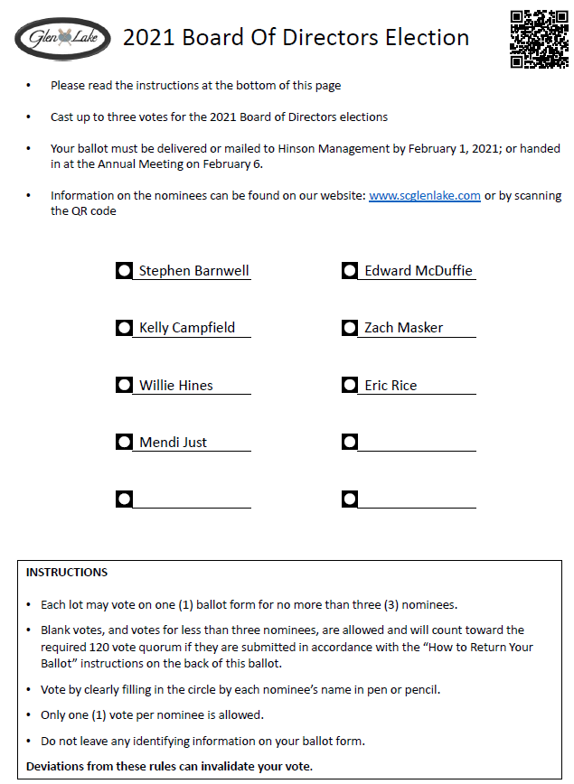
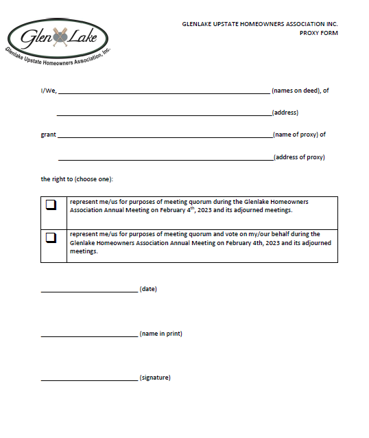

> Author: Rob Hanssen

> Version: August 05, 2024

# Purpose

Organizing the elections of the Board of Directors and the Annual
Meeting are essential parts of the function of the Board of Directors.
Elections take place every year at the Annual Meeting. This guideline
offers a time line to organize the elections and the Annual Meeting in
an efficient manner.

# Background

## History

During the first election after the developer handover in 2018, seven
Directors were elected in accordance with the
Bylaws,1,2 four of those with a term of
two years and three with a term of one year. All directors elected after
the first election will have a two-year term.2 Because of the
staggering of terms, during the odd years (*e.g.* 2023, 2025, 2027,
etc.), three positions are available and during the even years (*e.g.*
2024, 2026, 2028, etc.), four positions are available. In accordance
with the Bylaws, one position on the Board of Directors must be filled
by a representative of the Town Home owners.3

## Vacancies

Positions that are vacant due to resignation of a Director need to be
filled by a vote of the Board of Directors if the term of the vacant
position is not due during the elections, however the Board can choose
to elicit input in filling the position using the ballot. This will not
change the length of the term of the position.4

## Candidate qualifications

The qualifications for the nominees
are:5,6

1.  An owner of a home within Glen Lake in good standing
2.  Residing in the neighborhood
3.  Not be a spouse of a board member

*Good standing* is defined as having paid all annual assessments and
fines6,7 and having no suspension of
voting rights for any reason.6,8 *Owner
of a home* is defined as being listed on the deed or be the spouse of
the person listed on the
deed.5,9,10

## The Nomination Committee

The Nomination Committee is authorized in the Bylaws11 and
created by the Board of Directors via a resolution.12 The
task of the Nomination Committee is to organize the election process,
the Town Hall meetings, the Annual Meeting and the Organizational
Meeting. During this process, several letters need to be sent out to the
homeowners with approval of the Board of Directors; a location for the
Annual Meeting needs to be found, approved by the Board and booked; a
location for the Town Halls (typically the Glen Lake Club House) needs
to be booked. To facilitate communication to the homeowners, signs can
be printed, and social media can be used.

# Guidelines for the timing of specific actions and events:

## Early-October: Assemble the Nominations Committee

Volunteers are appointed to the Nominations Committee.

## Early to Mid-December: Send nomination letter to all HOA members

This letter serves as the request for nominations to run for the Board.
Typically, the term for the return of nominations is 2 to 4 weeks. The
Christmas and New Year’s vacation will cause delays in the return and
all care should be taken to have the nomination letters in the member’s
home before December 24th. This letter can also be used to
request questions that can be used at the Town Hall meetings. The last
function of this letter can be to announce the date of the Annual
Meeting, however the Annual Meeting can officially only be announced up
to 60 days before the date of the Annual Meeting.13 The best
opportunity to send this letter is to add it to the budget package sent
out mid-November to limit the expense.

For convenience and speed, the nomination form and town hall questions
form can also be made available on the Association website. During the
2019 elections, all nominations and most questions came in via the
website.

See Appendix 1 for an example letter and nomination form.

## Mid-December: Secure the location to be used for the Annual Meeting

For all elections since 2020 the Glen Lake Club House was used at no
cost. Alternatively, in 2018 and 2019, the lunchroom of Boiling Springs
Elementary School was used to host the Annual Meeting and Elections (the
cost was approximately $150). Other locations can also be used. The
location should be able to host 50 people and should have a PA system.

## Mid-January: Send ballot and accompanying letter to all HOA members

This letter serves as the final announcement for the Annual Meeting and
will describe the voting process. The letter is typically sent, so that
receipt of the ballot coincides with the nomination town halls, however
the latest this announcement can be sent is 10 days before the Annual
Meeting.13 The letter and ballot should reference the quorum
needed to validate the election (25% of the Total Association Vote; 120
ballots).14,15

See Appendix 2 for an example letter and Appendix 3 for an example
ballot form.

## Mid-January: Nomination town halls

Typically, two town hall meetings are held where nominees for the Board
can answer questions from HOA members. These questions can come from the
audience or from pre-selected questions determined by the Nomination
Committee or otherwise. Depending on the size of the group of nominees,
there can be anywhere from 5 to 10 questions with answer times from 2 to
5 minutes. To increase participation of the homeowners, at least one
meeting should be scheduled on a weekend day.

## Mid-January: Announce the possibility of granting proxies

Homeowners can also grant other HOA members a proxy to attend the Annual
Meeting and vote on their behalf. All proxies shall be in writing,
dated, and filed with the Secretary before the appointed time of each
meeting. Every proxy is revocable and will automatically cease when the
proxied member’s lot is sold or when the proxied member is present at
the meeting.16

An example of a proxy form can be found in Appendix 4.

## Mid-January: Settle on a date for the Organizational Meeting

All Directors and nominees must agree on the date for the Organizational
meeting which will be held within 10 days of the Annual Meeting and
Board of Director elections. It is prudent to have a date available for
all potential Directors so that the Organizational Meeting can take
place in accordance with the Bylaws.17 The Organizational
Meeting can be announced on the website calendar.

## Mid-January: Organize the vote counters

The counting of the votes should be done by neutral parties, *i.e.*
homeowners with no ties to the nominees or third-party civic
organizations, such as the Beta Club, Scouts organizations, fraternities
or sororities, etc. If the Nomination Committee decides to use third
parties, these should be notified to participate. During most elections,
the Social Committee has volunteered as vote counters.

## Mid-January: Arrange the presence of a recording secretary **(OPTIONAL)**

To capture all information communicated from and to the homeowners
during the Annual Meeting, it is possible to use a third-party
professional recording secretary. The management company has a list of
people who can function as such. This person will need to be booked for
the event.

## Two weeks before the Annual Meeting

Determine if all the candidates are still eligible to enter the
elections. All candidates must have a zero-balance with the Association
and adhere to all other
requirements.5,6,8
The board can expel board members by a simple majority vote if they are
delinquent for 30 days or more.7 Because the due date for the
annual assessment is January 1st, members who did not pay by
February 1st are delinquent.

## One week before the Annual Meeting and Elections

Determine if the quorum for the Annual Meeting has been met (25% of the
Total Association Vote,14 approximately 120 votes or
proxies). If the quorum has not been reached, start a (social media or
other) campaign to ensure that the quorum is made before or at the
Annual Meeting. This is not an uncommon occurrence – in the elections of
2018 through 2022, the quorum was reached during the week before the
meeting after significant posting on social media and using signs at the
entrances.

It is advisable to add a statement on the ballot letter and the ballot
that states that the ballot is a proxy for presence at the meeting to
make sure that the quorum can be reached with ballots alone.

## Early to mid-February: Annual Meeting and Special Meeting for the election of the Board of Directors

The Annual Meeting must take place within 60 days from the end of the
previous fiscal year.18 The latest that the meeting can take
place is February 29th during leap years and March
1st during regular years. To increase participation from the
homeowners, the Annual Meeting is best scheduled on a weekend day,
however it is best to avoid Superbowl weekend. From the end of the
previous fiscal year until the day of the election, the board members
will hold office until their successors are elected.2

The agenda for the Annual Meeting must at least include the following
items. Other items are optional.

1.  Opening by the President of the Board of Directors
2.  Confirmation of the quorum (attendees, ballots, proxies)
3.  Call for nominations from the floor; Casting of votes; Motion to
    close the votes and commence with counting of the votes.
4.  Treasury report by the Treasurer
5.  Open forum
6.  Report of the results of the elections

*Ad 2.* If the quorum of the meeting is not met, the meeting cannot
proceed and must be adjourned to a meeting between 5 and 30 days
later.19 Because Association funds will need to be spent on
setting up a new meeting and announcing it to the homeowners, it is of
the utmost importance that the quorum is met before or at the original
meeting.

*Ad 3.* Nominations from the floor during the meeting is prescribed in
the Bylaws11 and must be called for. If there is a nomination
from the floor, the nominee must be given the opportunity to present
themselves to the audience. During the 2018 and 2019 elections, no one
was nominated in this fashion, and in 2020 one person was nominated from
the floor. The consequence of calling nominations from the floor is that
homeowners need to be able to change their ballots to accommodate voting
for the new nominees. New ballots will need to be available during the
meeting with blank spots for floor nominees.

*Ad 4.* The Annual Treasury report must be reviewed at the Annual
Meeting in a manner the Board of Directors can decide.20

*Ad 5.* The Open Forum is done in a manner the Board of Directors can
decide.

*Ad 6.* If there is a quorum, the nominees with the highest vote counts
will be elected to the Board of Directors. The results of the vote count
must be in the minutes of the meeting15 together with the
quorum requirement. One position on the Board of Directors must be
filled by a representative of the Town Homes who must also be on the
Town Home Committee.3 If no representative of the Town Homes
has enough votes to be elected to the Board, they will still be
appointed to the Board and replace the person on the Board who had the
lowest vote count.

The first meeting of the newly elected Board members must take place
within 10 days of the election and is called the Organizational
Meeting.17

## Mid-February: Organizational Meeting

The Board of Directors meets in a public meeting to elect the officers
(President, Vice President, Treasurer, Secretary) and handle the
transition of information to the newly elected Board members. The method
to elect Officers can be decided by the Directors. The length of the
term remaining to the Director is of no consequence to their ability to
be elected as Officer.

It is best to use this meeting to set the meeting schedule for the rest
of the year and communicate this schedule via regular mail. This meeting
should also include an executive session to transfer privacy-sensitive
information to the newly elected Board members.

# Regular Meetings

There must be at least one meeting per quarter,21 *i.e.* four
meetings per year. The Organizational Meeting counts as a regular
meeting for this requirement. If there are no deviations from the
schedule set during the Organizational Meeting and communicated via
regular mail, no further notice is required.21 For
convenience, the meetings can be announced on the Association website.
During regular meetings, a majority of the Board members needs to be
present to conduct any business.22

# Appendix 1a. Example nomination letter

Dear Fellow Glen Lake Homeowner:

The Nominations Committee is requesting nominations for three Board of
Director positions for the Glenlake Upstate Homeowners Association.

If you or someone you know is interested and meets the Glenlake Bylaw
criteria, please complete the attached nomination form.

Bylaw criteria:

1.  Elected directors must reside in the Glen Lake Subdivision
2.  Must be a member in good standing (or be a spouse of a member). A
    member is the legal owner of a lot in the Glen Lake Subdivision
3.  Cannot have a spouse concurrently on the Board.

All nominations must be delivered or mailed to Hinson Management at PO
Box 160207, Boiling Springs no later than December 18, 2020. Nominations
can also be submitted on [our
website](https://www.scglenlake.com/p/Board-Election-Nominations-2021).
After all nomination forms are received and candidates are confirmed by
Nominations Committee, the candidates’ biographies will be posted on the
Glen Lake website.

Two Town Hall Meetings have been scheduled to allow all Glen Lake
members to hear the candidates’ answers to questions compiled by the
Nominations Committee based on member suggestions. Questions may be
submitted on [our
website](https://www.scglenlake.com/p/Submit-questions-for-nominees) or
via e-mail to <nominations@scglenlake.com>. Time permitting, questions
from the floor may be possible.

Glen Lake members should make every effort to attend one of these
meetings.

If you are a candidate, please plan to attend both Town Hall Meetings.

Nominee Town Hall Meetings will be held at the Glen Lake Clubhouse:

-   Saturday, January 16, 2021, 10:30am to 1:00pm
-   Thursday January 28, 2021, 6:30pm to 9:00pm

Cordially, The Nominations Committee

# Appendix 1b. Example nomination form

2019 Glenlake Upstate Homeowners Association Board Nomination

Name of person nominating:  
Address of person nominating:

Information on Nominee Name:  
Address:  
E-mail:

Pertinent work history:
\_\_\_\_\_\_\_\_\_\_\_\_\_\_\_\_\_\_\_\_\_\_\_\_\_\_\_\_\_\_\_\_\_\_\_\_\_\_\_\_\_\_\_\_\_\_\_\_\_\_\_\_\_\_\_\_\_\_\_\_\_\_\_\_\_\_
\_\_\_\_\_\_\_\_\_\_\_\_\_\_\_\_\_\_\_\_\_\_\_\_\_\_\_\_\_\_\_\_\_\_\_\_\_\_\_\_\_\_\_\_\_\_\_\_\_\_\_\_\_\_\_\_\_\_\_\_\_\_\_\_\_\_\_\_\_\_\_\_\_\_\_\_\_\_\_\_\_\_\_\_\_\_\_\_\_\_\_\_\_\_\_\_\_\_\_\_\_\_\_\_\_\_\_\_\_\_\_\_\_\_\_\_\_\_\_\_\_\_\_\_\_\_\_\_\_\_\_\_\_\_\_\_\_\_\_\_\_\_\_\_\_\_\_\_\_\_\_\_\_\_\_\_\_\_\_\_\_\_\_\_\_\_\_\_\_\_

Other skills, knowledge, & experience:
\_\_\_\_\_\_\_\_\_\_\_\_\_\_\_\_\_\_\_\_\_\_\_\_\_\_\_\_\_\_\_\_\_\_\_\_\_\_\_\_\_\_\_\_\_\_\_\_\_\_\_
\_\_\_\_\_\_\_\_\_\_\_\_\_\_\_\_\_\_\_\_\_\_\_\_\_\_\_\_\_\_\_\_\_\_\_\_\_\_\_\_\_\_\_\_\_\_\_\_\_\_\_\_\_\_\_\_\_\_\_\_\_\_\_\_\_\_\_\_\_\_\_\_\_\_\_\_\_\_\_\_\_\_\_\_\_
\_\_\_\_\_\_\_\_\_\_\_\_\_\_\_\_\_\_\_\_\_\_\_\_\_\_\_\_\_\_\_\_\_\_\_\_\_\_\_\_\_\_\_\_\_\_\_\_\_\_\_\_\_\_\_\_\_\_\_\_\_\_\_\_\_\_\_\_\_\_\_\_\_\_\_\_\_\_\_\_\_\_\_\_\_

Reason(s) interested in serving: \_\_\_\_\_\_
\_\_\_\_\_\_\_\_\_\_\_\_\_\_\_\_\_\_\_\_\_\_\_\_\_\_\_\_\_\_\_\_\_\_\_\_\_\_\_\_\_\_\_\_\_\_\_\_\_\_\_\_\_\_\_\_\_\_\_\_\_\_\_\_\_\_\_\_\_\_\_\_\_\_\_\_\_\_\_\_\_\_\_\_\_
\_\_\_\_\_\_\_\_\_\_\_\_\_\_\_\_\_\_\_\_\_\_\_\_\_\_\_\_\_\_\_\_\_\_\_\_\_\_\_\_\_\_\_\_\_\_\_\_\_\_\_\_\_\_\_\_\_\_\_\_\_\_\_\_\_\_\_\_\_\_\_\_\_\_\_\_\_\_\_\_\_\_\_\_\_

Most important factors facing the HOA:
\_\_\_\_\_\_\_\_\_\_\_\_\_\_\_\_\_\_\_\_\_\_\_\_
\_\_\_\_\_\_\_\_\_\_\_\_\_\_\_\_\_\_\_\_\_\_\_\_\_\_\_\_\_\_\_\_\_\_\_\_\_\_\_\_\_\_\_\_\_\_\_\_\_\_\_\_\_\_\_\_\_\_\_\_\_\_\_\_\_\_\_\_\_\_\_\_\_\_\_\_\_\_\_\_\_\_\_\_\_\_\_\_\_\_\_\_\_\_\_\_\_\_\_\_\_\_\_\_\_\_\_\_\_\_\_\_\_\_\_\_\_\_\_\_\_\_\_\_\_\_\_\_\_\_\_\_\_\_\_\_\_\_\_\_\_\_\_\_\_\_\_\_\_\_\_\_\_\_\_\_\_\_\_\_\_\_\_\_\_\_\_\_\_\_\_\_\_\_\_\_\_\_\_\_\_\_\_\_\_\_\_\_\_\_\_\_\_\_\_\_\_\_\_\_\_\_\_\_\_\_\_\_\_\_\_\_\_\_\_\_\_\_\_\_\_\_\_\_\_\_\_\_\_\_\_\_\_\_\_\_\_\_\_\_\_\_\_\_\_\_\_\_

If you are nominating someone else, has he/she agreed to serve? \_\_\_
Yes; \_\_\_ No

The nominee acknowledges that serving on the Board is a significant time
commitment (over 10 hours of meetings per month, and additionally 20
hours of activities per month). During budgeting and election time, this
time commitment will be higher. The nominee acknowledges that the term
for this Board position is two (2) years. The nominee agrees to sign the
Board Member Code of Ethics when elected. \_\_\_ Yes; \_\_\_ No

Would you be willing and able to serve as Officer on the board? \_\_\_
President; \_\_\_ Treasurer; \_\_\_ Secretary; \_\_\_ Vice-president

# Appendix 2. Example of announcement letter to the Annual Meeting

Dear Glen Lake homeowner:

The Annual Meeting of the Glenlake Homeowners Association, Inc is
scheduled for Saturday, February 6, 2021 from 10:30 am to 1:00 pm at the
Glen Lake Club House, 202 Stewarts Landing. Please plan to arrive 10 to
15 minutes before the start of the meeting to register and receive your
copy of the 2020 Financial Summary.

A ballot for election of the 2021 Board of Directors is enclosed. If you
have not met the candidates, please review the information posted on the
[website](http://www.scglenlake.com) for background details.

For the election to be valid at least 25% of the homes in Glen Lake
(i.e. 120) must return a ballot. If you do not want to vote, please
return your blank ballot so it can be counted toward the quorum. If a
quorum is not reached, the Annual Meeting will be postponed until a
quorum can be reached.

All votes must be received at the offices of Hinson Management, Inc by
5:00 pm on Monday, February 1, 2021. If a quorum has not been reached,
the Annual Meeting will have to be postponed at significant cost to the
community.

HOW TO RETURN YOUR BALLOT

1.  After voting, fold the ballot and place in envelope marked “Ballot”.
    Do NOT write anything on this envelope. SEAL.
2.  Place the ballot envelope inside the medium envelope with your
    return name and address in upper left corner. (correct any
    information, as needed). SIGN and SEAL this envelope.  
3.  Place the 2-envelope ballot in the outer envelope addressed to
    Hinson Management, ATTN Glen Lake Board of Directors election. SEAL.

Mail or drop off at Hinson during business hours.

It is Hinson’s responsibility to use the unopened signed envelopes to
verify your right to vote, record that your household has voted and add
your vote to the quorum tally. These envelopes are placed in the ballot
box and, providing a quorum has been reached, will be publicly opened
and counted at the Annual Meeting.

Sincerely,

The Board of Directors

# Appendix 3. Example ballot

# Appendix 4. Proxy form

# References

(1)
Article 3.3. *Bylaws of the
Glenlake Upstate Homeowners Association*, 2006.

(2)
Article 3.5(b). *Bylaws of the
Glenlake Upstate Homeowners Association*, 2006.

(3)
Article 3.5(c). *Bylaws of the
Glenlake Upstate Homeowners Association*, 2006.

(4)
Article 3.7. *Bylaws of the
Glenlake Upstate Homeowners Association*, 2006.

(5)
Article 3.1. *Bylaws of the
Glenlake Upstate Homeowners Association*, 2006.

(6)
Article 5.11(c). *Protective
Covenants, Conditions and Restrictions of the Glenlake Upstate
Homeowners Association*, 2006.

(7)
Article 3.6. *Bylaws of the
Glenlake Upstate Homeowners Association*, 2006.

(8)
Article 14.2(a)(3). *Protective
Covenants, Conditions and Restrictions of the Glenlake Upstate
Homeowners Association*, 2006.

(9)
Article 4.2. *Protective
Covenants, Conditions and Restrictions of the Glenlake Upstate
Homeowners Association*, 2006.

(10)
Article 1, Definition of Owner:
The Record Owner, Whether One or More Persons, of the Fee Simple Title
to Any Lot Located Within the Community; Excluding Any Person Holding
Such Interest Merely as Security for the Performance or Satisfaction of
Any Obligation. *Protective Covenants, Conditions and Restrictions of
the Glenlake Upstate Homeowners Association*, 2006.

(11)
Article 3.4. *Bylaws of the
Glenlake Upstate Homeowners Association*, 2006.

(12)
Resolution 2018-012. *Resolutions
of the Glenlake Upstate Homeowners Association*, 2018.

(13)
Article 2.4. *Bylaws of the
Glenlake Upstate Homeowners Association*, 2006.

(14)
Article 2.9. *Bylaws of the
Glenlake Upstate Homeowners Association*, 2006.

(15)
Article 2.11. *Bylaws of the
Glenlake Upstate Homeowners Association*, 2006.

(16)
Article 2.8. *Bylaws of the
Glenlake Upstate Homeowners Association*, 2006.

(17)
Article 3.8. *Bylaws of the
Glenlake Upstate Homeowners Association*, 2006.

(18)
Article 2.2. *Bylaws of the
Glenlake Upstate Homeowners Association*, 2006.

(19)
Article 2.6. *Bylaws of the
Glenlake Upstate Homeowners Association*, 2006.

(20)
Article 15.12. *Protective
Covenants, Conditions and Restrictions of the Glenlake Upstate
Homeowners Association*, 2006.

(21)
Article 3.9. *Bylaws of the
Glenlake Upstate Homeowners Association*, 2006.

(22)
Article 3.12. *Bylaws of the
Glenlake Upstate Homeowners Association*, 2006.
